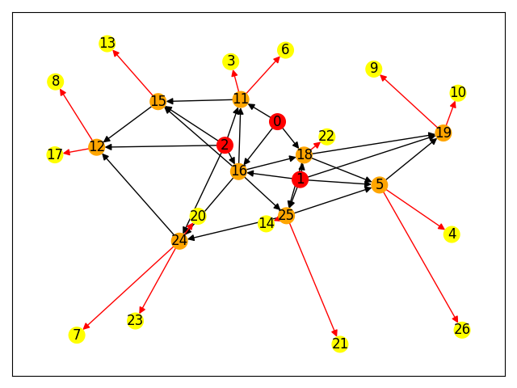

# The $\kappa$-Connected Arborescence–Star Problem

**Formulation and Branch-and-Cut Implementation**

This repository provides a reference implementation for the **$\kappa$-connected Arborescence–Star Problem** on directed graphs. It includes: 

(i) data generation utilities, 

(ii) a mixed-integer programming (MIP) model constructed in DOCplex, 

(iii) CPLEX callback routines for branch-and-cut (lazy and user cuts), and 

(iv) a NetworkX/Matplotlib visualizer for solutions. 

Intuitively, given a directed graph with a designated set of roots $\mathcal{R}$ and customer vertices $\mathcal{V}$, the goal is to select an arborescence-like backbone (a union of rooted directed trees) and to either place customers on the backbone or assign them to backbone vertices, while enforcing **$\kappa$-connectivity**: each backbone vertex must admit at least $\kappa$ pairwise edge-disjoint directed paths from distinct roots. The model internalizes a cost trade-off between building backbone arcs and assigning customers.



---

## Repository Layout

```
.
├─ main.py          # Entry point: data generation → model build → callbacks → solve → plot
├─ data.py          # Data utilities: random coordinates, arc sets, cost matrices
├─ model.py         # MIP model (DOCplex): variables, objective, constraints
├─ callback.py      # CPLEX callbacks: lazy cuts, user cuts, incumbent logging
├─ plot.py          # Visualization (NetworkX + Matplotlib)
├─ example.png      # Sample output figure
├─ The_kappa_connected_Arborescence_Star_Problem__Formulation_and_Branch_and_Cut_Algorithm.pdf
└─ README.md
```

---

## Requirements and Installation

### Prerequisites

* **Python** ≥ 3.8
* **IBM ILOG CPLEX Optimization Studio** (with a valid license)
* Python packages: `cplex` (the solver’s Python API), `docplex`, `numpy`, `networkx`, `matplotlib`

> **Note.** `docplex` is only the modeling layer. A local CPLEX installation is required to run the MIP with callbacks.

### Suggested Conda Environment

```bash
conda create -n kfsp python=3.10 -y
conda activate kfsp
pip install numpy networkx matplotlib docplex
```

---

## Quick Start

1. **Configure instance parameters** (optional)
   Open `main.py` and adjust the default parameters, for example:

   ```python
   num_of_roots, num_of_customers = 3, 24
   k, const, seed = 3, 2, 0        # κ (connectivity), assignment-cost factor, RNG seed
   p.create_data(const=const, seed=seed, width=100)
   ```

   * `const=None` makes assignment costs proportional to arc costs (e.g., (a = k\cdot c));
     otherwise (a = \texttt{const}\cdot c).

2. **Solve and visualize**

   ```bash
   python main.py
   ```

   The script prints solver progress and objective values, then renders a solution plot.

---

## Input Model and Parameters

* **Graph construction.** `data.py` samples vertex coordinates and builds a directed graph (complete or sparsified, depending on the routine), together with:

  * arc cost matrix (c_{ij}) (backbone construction cost),
  * assignment cost matrix (a_{ij}) (assigning customer (j) to backbone vertex (i)).

* **Key parameters.**

  * `num_of_roots = |R|` — number of root (supply) vertices.
  * `num_of_customers = |V|` — number of customer vertices.
  * `k` — κ-connectivity requirement (edge-disjoint root-to-vertex paths from **distinct** roots).
  * `const` — assignment-to-arc cost scaling (see above).
  * `seed`, `width` — randomness and geometric scaling for instance generation.

---

## Optimization Model (High-Level)

Let (x_{ij}\in{0,1}) indicate whether arc ((i,j)) is in the backbone,
(y_{ij}\in{0,1}) whether customer (j) is assigned to backbone vertex (i), and
(w_i\in{0,1}) whether vertex (i) lies on the backbone.

* **Objective.**
  [
  \min \sum_{(i,j)} c_{ij},x_{ij} ;+; \sum_{(i,j)} a_{ij},y_{ij}.
  ]

* **Structural constraints** (implemented in `model.py`):

  * Root designation and arborescence-style in-degree controls for non-roots.
  * Compatibility: assignments allowed only to backbone vertices.
  * Prohibitions on trivial symmetric 2-cycles, and additional linking logic between (x), (y), (w).

* **κ-connectivity constraints** (separated as lazy cuts in `callback.py`):
  For any subset (S\subseteq V) and for each demand configuration, enforce that the number of arcs leaving (S) is sufficiently large to guarantee κ edge-disjoint root-to-(S) connectivity from distinct roots. In practice, violated cuts are identified via min-cut routines on appropriately constructed auxiliary networks and added on the fly as **lazy constraints** (and, when helpful, as **user cuts**).

This separation scheme follows the standard branch-and-cut paradigm: solve relaxations, detect violations, add cuts, and continue until convergence.

---

## Visualization

`plot.py` renders the optimized backbone and assignments:

* **Roots** are displayed in red.
* **Backbone vertices** and **assigned customers** are distinguished by color/shape.
* **Black arcs** show selected backbone/assignment arcs, following the optimized (x) and (y).

You may also call the routine directly from Python:

```python
from plot import plot_graph
plot_graph(data_obj, model_obj)
```

---

## Reproducibility and Scaling Tips

* Fix `seed` to reproduce a specific instance.
* Increase `const` to bias the solution toward assignments (smaller backbone).
* Reduce `num_of_customers` or `k` for faster runs; κ-connectivity substantially tightens the problem.
* Solver performance is sensitive to the sparsity of the candidate arc set; consider pruning long arcs when experimenting with larger instances.

---

